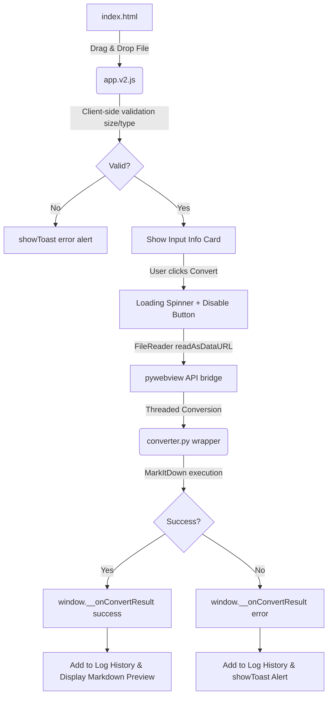

# Gemini Developer Guide: File → Markdown Converter

This guide outlines the architecture, state machine flow, API integration, and frontend components of the local-first desktop **File → Markdown** converter. Use this document as a quick reference for understanding code structure, refactoring, and debugging.

---

## 📂 Project Structure

```text
md-converter/
├── app.py               # Application entry point & webview window lifecycle
├── converter.py         # Microsoft MarkItDown local conversion engine wrapper
├── requirements.txt     # Python runtime dependencies
├── build.py             # Packaging script (PyInstaller config)
├── frontend/
│   ├── index.html       # Single Page Application HTML structure
│   ├── app.v2.js        # Drag/drop, validation, API integration, UI handlers
│   └── style.v2.css     # CSS variable stylesheet (cache-busted)
└── GEMINI.md            # This documentation file
```

---

## ⚙️ Core Architecture & Flow

The app operates fully offline using a native browser window managed by `pywebview` in Python (using WebView2 on Windows).



---

## 🐍 Backend API & Execution (`app.py` & `converter.py`)

*   **API Bridge:** The `Api` class in `app.py` is exposed to JavaScript as `window.pywebview.api`.
*   **Introspector Safety:** The webview reference on the API class is stored as `self._window` (prefixed with `_`). This prevents the `pywebview` introspector from recursively analyzing the window object and causing WebView2 to hang.
*   **Background Threads:** Conversions are run inside a python `threading.Thread(daemon=True)`. This keeps the API bridge thread free so the frontend remains completely responsive (with loading animations) during CPU-heavy conversions.
*   **MarkItDown Configurations:** Uses `MarkItDown()` as the engine. Audio transcription is omitted because it defaults to Google's online speech API.

---

## 🎨 Unified Three-Column Workspace Layout

Instead of a multi-stage wizard, the UI uses a desktop-grade side-by-side workspace:

1.  **Left Column (Input File / Selection):**
    *   Shows a dashed `dropzone` for file selection or dropping when no file is selected.
    *   Displays a compact `selected-card` with `[filename] -> [.md]` preview badges once a file is selected.
    *   Resets selection automatically upon a successful conversion, or updates when a new file is dropped.
2.  **Middle Column (Conversion Control & Log History):**
    *   Contains the centered primary **Convert** button.
    *   Underneath the Convert button, displays a persistent **Log History** block showing a scrollable list of recent conversion runs.
    *   Conversion results (success/failure status and conversion times) are captured and saved.
    *   Clicking a successful history item reloads its markdown contents into the preview area. Clicking a failed item toasts the conversion error.
    *   Includes a "Clear" link to empty the log history.
3.  **Right Column (Output Preview):**
    *   Displays the toolbar and HTML preview container directly on startup (with Copy and Download buttons disabled initially).
    *   Loads metadata and renders the HTML preview in the output panel once a conversion is loaded or selected from history.
    *   Provides standard action buttons to Clear the active preview panel, Copy the raw markdown text in memory, or Download it as a `.md` file (in the order: `[Clear]`, `[Copy]`, `[Download .md]`).

---

## 💾 State & Log Persistence

*   **Logs Array:** Log history items are stored in a JavaScript array `logs` containing metadata. The `markdown` text is omitted from the saved JSON string in `localStorage` and instead saved to local disk cache files.
*   **Disk Cache Integration:** Successful markdown outputs are written locally to the user's home directory (`~/.md-converter/history/<id>.md`) using Python's API. Clicking a history item calls `window.pywebview.api.read_history_file(id)` to load its content.
*   **LocalStorage Sync:** The history metadata list (filename, timestamp, success/error state, and file ID) is saved to the browser's database as `"md_converter_logs"`. It is loaded automatically on startup, preserving past entries across sessions.
*   **Cap Limits:** To prevent storage limits (5MB) from being exceeded, history is capped at `50` items. Old items are deleted from both the `localStorage` metadata list and the local disk cache directory automatically.

---

## 🛡️ Cache Bypassing
WebView2 stores aggressive browser caches for CSS/JS resources. To deploy style or script updates safely:
*   Modify layout code in `style.v2.css` and scripting in `app.v2.js`.
*   Maintain the cache-busting filename structure (`style.vN.css` and `app.vN.js`) in the html loader:
    ```html
    <link rel="stylesheet" href="style.v2.css" />
    <script src="app.v2.js"></script>
    ```

---

## ⌨️ Global Keyboard Shortcuts

| Shortcut | Context | Description |
| :--- | :--- | :--- |
| **`Escape`** | Selection active / Preview active | Clears the selected file or resets the active markdown preview. |
| **`Ctrl / Cmd + Enter`** | File selected | Submits the file for conversion. |
| **`Ctrl / Cmd + C`** | Markdown preview active | Copies the raw markdown (when no text selection is active). |
